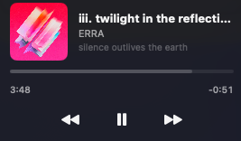

# MuseBar

A lightweight macOS menu bar app that displays the currently playing track from Apple Music.




## Features

- Shows **artist and track name** in the menu bar with album artwork
- Dropdown with **album art**, track details, and a **seekable progress bar**
- **Playback controls** — previous, play/pause, next
- Lightweight — no Dock icon, runs entirely in the menu bar

## Requirements

- macOS 13 (Ventura) or later
- [just](https://github.com/casey/just) command runner
- Swift 5.9+

## Install

```
just
```

This builds the app, copies it to `/Applications`, and launches it.

On first launch, macOS will ask permission for MuseBar to control Music — click **OK**.

## Usage

| Command       | Description                          |
|---------------|--------------------------------------|
| `just`        | Build and install to /Applications   |
| `just build`  | Build the .app bundle                |
| `just run`    | Build and run from the terminal      |
| `just clean`  | Remove build artifacts               |

## How It Works

MuseBar uses AppleScript to query Apple Music for the current track, artwork, and playback position. It listens for distributed notifications from Music.app to update in real time when tracks change or playback state changes.

## License

MIT
